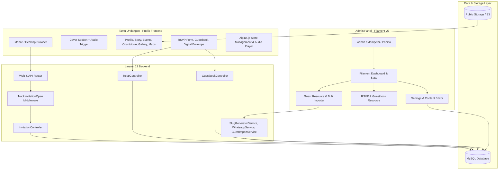
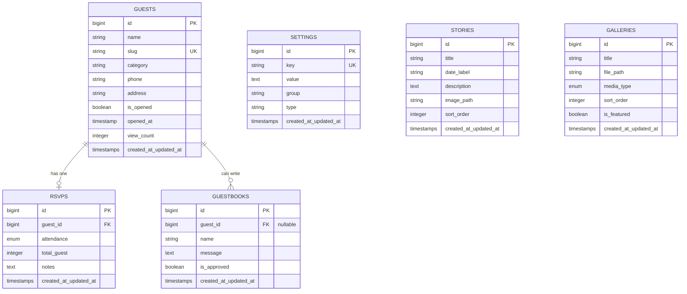

# 🏛️ Architecture & System Design Document
## Digital Wedding Invitation Platform

> **Version:** 1.0.0  
> **Target Framework:** Laravel 12 + Filament PHP v5 + Blade + Alpine.js + Tailwind CSS  
> **Database:** MySQL 8.x / MariaDB 10.x  
> **Document Status:** Active / Approved  

---

## 1. Executive Summary & Core Objectives

Aplikasi **Digital Wedding Invitation** dirancang untuk memberikan pengalaman undangan pernikahan digital yang sangat personal (*per-guest personalized experience*), interaktif, dan mulus di perangkat mobile. 

### Core Value Propositions:
1. **Personalized Link Generation:** Setiap tamu memiliki URL unik (`domain.com/{slug}`) yang mempersonalisasi konten undangan (nama, salam, dan ucapan).
2. **Engagement & Interaction:** Dilengkapi fitur RSVP interaktif, buku tamu digital (*guestbook*), countdown timer, galeri prewedding, peta lokasi Google Maps, dan amplop digital (rekening/QRIS).
3. **Seamless Mobile-First UI/UX:** Dioptimalkan untuk perangkat mobile dengan animasi halus, background music autoplay yang ramah browser policy (diaktifkan saat interaksi "Buka Undangan"), serta dukungan multi-bahasa (ID / EN / TR).
4. **Powerful Admin Management (Filament v5):** Dashboard terpadu untuk mengelola data tamu, import massal via Excel, generate slug otomatis, kirim link via WhatsApp, pemantauan status kehadiran (RSVP), rekap statistik, serta penyesuaian konten undangan tanpa mengubah kode.

---

## 2. System Architecture



---

## 3. Database Schema & Data Models

### 3.1 Entity Relationship Diagram (ERD)



### 3.2 Table Definitions

#### `guests`
| Kolom | Tipe | Index/Constraint | Keterangan |
|---|---|---|---|
| `id` | BIGINT UNSIGNED | PRIMARY KEY, AUTO_INCREMENT | ID unik tamu |
| `name` | VARCHAR(255) | NOT NULL, INDEX | Nama tamu lengkap (misal: "Bapak Dr. H. Fulan & Partner") |
| `slug` | VARCHAR(100) | UNIQUE, NOT NULL, INDEX | URL identifier (misal: `endeng-zenal-x8f2`) |
| `category` | VARCHAR(100) | DEFAULT 'Umum', INDEX | Kategori (Keluarga, Sahabat, Kolega, Alumni) |
| `phone` | VARCHAR(50) | NULLABLE | Nomor WhatsApp untuk pengiriman link |
| `address` | VARCHAR(255) | NULLABLE | Alamat / Domisili tamu |
| `is_opened` | BOOLEAN | DEFAULT 0, INDEX | Status apakah undangan sudah dibuka |
| `opened_at` | TIMESTAMP | NULLABLE | Timestamp pertama kali dibuka |
| `view_count` | INT UNSIGNED | DEFAULT 0 | Jumlah total pembukaan undangan |
| `created_at` / `updated_at` | TIMESTAMP | | Standard Laravel timestamps |

#### `rsvps`
| Kolom | Tipe | Index/Constraint | Keterangan |
|---|---|---|---|
| `id` | BIGINT UNSIGNED | PRIMARY KEY, AUTO_INCREMENT | ID unik RSVP |
| `guest_id` | BIGINT UNSIGNED | FOREIGN KEY -> guests(id) ON DELETE CASCADE | Relasi ke tamu |
| `attendance` | ENUM('hadir', 'tidak_hadir', 'ragu') | NOT NULL | Status konfirmasi kehadiran |
| `total_guest` | INT UNSIGNED | DEFAULT 1 | Jumlah orang yang hadir |
| `notes` | TEXT | NULLABLE | Catatan tambahan |
| `created_at` / `updated_at` | TIMESTAMP | | Standard Laravel timestamps |

#### `guestbooks`
| Kolom | Tipe | Index/Constraint | Keterangan |
|---|---|---|---|
| `id` | BIGINT UNSIGNED | PRIMARY KEY, AUTO_INCREMENT | ID unik ucapan |
| `guest_id` | BIGINT UNSIGNED | NULLABLE, FOREIGN KEY -> guests(id) ON DELETE SET NULL | Relasi ke tamu (jika dari link personal) |
| `name` | VARCHAR(255) | NOT NULL | Nama pemberi ucapan |
| `message` | TEXT | NOT NULL | Isi doa dan ucapan |
| `is_approved` | BOOLEAN | DEFAULT 1, INDEX | Moderasi ucapan (default langsung tayang) |
| `created_at` / `updated_at` | TIMESTAMP | | Standard Laravel timestamps |

#### `settings`
| Kolom | Tipe | Index/Constraint | Keterangan |
|---|---|---|---|
| `id` | BIGINT UNSIGNED | PRIMARY KEY, AUTO_INCREMENT | ID setting |
| `key` | VARCHAR(100) | UNIQUE, NOT NULL, INDEX | Identifier setting (misal: `groom_nickname`, `event_date`) |
| `value` | LONGTEXT | NULLABLE | Nilai setting (teks, JSON, url) |
| `group` | VARCHAR(50) | NOT NULL, INDEX | Pengelompokan: `general`, `couple`, `event`, `theme`, `audio` |
| `type` | VARCHAR(50) | DEFAULT 'text' | Tipe data input (`text`, `textarea`, `image`, `json`, `datetime`, `boolean`) |
| `created_at` / `updated_at` | TIMESTAMP | | Standard Laravel timestamps |

---

## 4. URL Routing & Slug Generator Specification

### 4.1 URL Formats
1. **Personal Link:** `https://domain.com/{slug}`  
   Contoh: `https://domain.com/endeng-zenal-x8f2`
2. **Fallback / General Public Link:** `https://domain.com`  
   Menampilkan nama umum seperti *"Tamu Undangan & Kerabat"*.
3. **Admin Panel:** `https://domain.com/admin` (Filament v5 authentication)

### 4.2 Slug Generator Algorithm (`SlugGeneratorService`)
1. Bersihkan nama dari karakter khusus & gelar (opsional) atau gunakan `Str::slug($name)`.
2. Batasi panjang slug string ke 30 karakter.
3. Tambahkan random hexadecimal entropy string 4 karakter (misal: `Str::lower(Str::random(4))`).
4. Cek collision pada database `Guest::where('slug', $slug)->exists()`. Jika ada duplikat, lakukan regenerasi suffix.

---

## 5. Public Frontend & Guest UX Architecture

### 5.1 Sections Breakdown
1. **Cover / Hero Overlay (Tap to Open):**
   - Menampilkan logo/monogram pasangan, nama acara, tanggal, dan nama tamu yang dipersonalisasi:  
     `"Kepada Yth. Bapak/Ibu/Saudara/i [Guest Name]"`
   - Tombol **"Buka Undangan"** berfungsi ganda:
     1. Memicu animasi smooth reveal / scroll ke konten utama.
     2. Men-trigger audio element HTML5 untuk play background music (mengatasi Autoplay Policy pada browser iOS Safari & Android Chrome).
     3. Mengirim ping asinkron atau dieksekusi middleware untuk mencatat `is_opened = true` dan `opened_at = now()`.

2. **Ayat Suci / Quote Pembuka:**
   - Kutipan ayat (contoh: QS. Ar-Rum: 21) atau doa pernikahan dengan tipografi kaligrafi / serif elegan.

3. **Profil Mempelai (The Couple):**
   - Profil Pria: Foto, Nama Lengkap, Putra ke-.. dari Bpk. ... & Ibu ...
   - Profil Wanita: Foto, Nama Lengkap, Putri ke-.. dari Bpk. ... & Ibu ...
   - Ikon media sosial (Instagram).

4. **Love Story / Timeline:**
   - Cerita pertemuan pertama, masa pendekatan, lamaran, hingga menuju pernikahan.

5. **Detail Acara & Countdown:**
   - **Akad Nikah:** Hari, Tanggal, Waktu (WIB), Lokasi & Alamat Lengkap.
   - **Resepsi / Tasyakuran:** Hari, Tanggal, Waktu (WIB), Lokasi & Alamat Lengkap.
   - Tombol **"Simpan ke Google Calendar"** (*Add to Calendar URL generator*).
   - **Live Countdown Timer** (Alpine.js component) menghitung mundur Hari, Jam, Menit, Detik.

6. **Lokasi & Google Maps Embed:**
   - Peta interaktif iframe Google Maps.
   - Tombol shortcut **"Buka di Google Maps"** (langsung membuka aplikasi Google Maps di smartphone).

7. **Galeri Prewedding:**
   - Grid foto masonry / carousel dengan Lightbox fullscreen modal saat diklik.

8. **RSVP Form:**
   - Form konfirmasi kehadiran:
     - Nama (Auto-fill dari guest slug, readonly atau editable).
     - Pilihan kehadiran: `Hadir`, `Tidak Hadir`, `Masih Ragu`.
     - Jumlah Tamu (1 s/d 5 orang).
     - Submit via AJAX/Fetch tanpa reload halaman dengan status notifikasi sukses yang elegan.

9. **Buku Tamu / Ucapan (Guestbook):**
   - Form input ucapan & doa restu.
   - List ucapan mengalir (*feed*) dengan pagination / auto-scroll card.

10. **Amplop Digital / Wedding Gift:**
    - Nomor Rekening Bank (BCA, Mandiri, BSI, dsb) + Nama Pemilik Rekening.
    - Tombol **"Salin Nomor Rekening"** dengan visual feedback "Berhasil Disalin!".
    - Gambar QRIS statis / dinamis dengan tombol download/perbesar.
    - Opsi kirim kado fisik (Alamat pengiriman kado).

11. **Music Player Floating Widget:**
    - Floating button di pojok bawah (play/pause/mute toggle).
    - Animasi vinyl berputar saat lagu aktif.


---

## 6. Admin Panel Architecture (Filament PHP v5)

### 6.1 Filament Resources & Pages
- **`GuestResource`:**
  - Table: Nama, Slug, Kategori, No WA, Status Dibuka (Badge), Timestamp Dibuka, Total RSVP.
  - Actions:
    - *Copy Personalized Link*
    - *Send WhatsApp Invitation* (Direct link ke `https://wa.me/{phone}?text=...`)
    - *View QR Code*
- **`BulkGuestImportPage`:**
  - Upload file `.xlsx` / `.csv`.
  - Preview data kolom: Nama, Kategori, Nomor WhatsApp.
  - Auto-generate slug unik secara batch.
- **`RsvpResource`:**
  - Tabel kehadiran tamu, filter status kehadiran, rekap total pax hadir.
  - Export data RSVP ke Excel.
- **`GuestbookResource`:**
  - Moderasi ucapan, filter status, delete ucapan spam.
- **`SettingResource` / Custom Settings Page:**
  - Form dinamis untuk mengedit teks mempelai, tanggal acara, link maps, playlist audio, rekening bank, dll.
- **`StatsOverviewWidget`:**
  - Metrics Cards: Total Tamu, Undangan Dibuka (%), Total Hadir (Pax), Total Ucapan Masuk.

---

## 7. WhatsApp Integration Flow

```
+-------------------------------------------------------------+
| Template Pesan WhatsApp:                                    |
|                                                             |
| Kepada Yth. {guest_name},                                   |
|                                                             |
| Tanpa mengurangi rasa hormat, perkenankan kami mengundang   |
| Bapak/Ibu/Saudara/i untuk hadir di hari bahagia kami:       |
|                                                             |
| {groom_nickname} & {bride_nickname}                         |
|                                                             |
| Link Undangan:                                              |
| {personal_url}                                              |
|                                                             |
| Merupakan suatu kehormatan dan kebahagiaan bagi kami        |
| apabila berkenan hadir dan memberikan doa restu.            |
|                                                             |
| Terima kasih.                                               |
+-------------------------------------------------------------+
```

Tombol di Filament Admin akan men-generate URL intent WhatsApp:
`https://api.whatsapp.com/send?phone={phone}&text={encoded_message}`

---

## 8. UI/UX Design System & Tokens

### 8.1 Color Palette Guidelines (Champagne & Emerald Elegance)
- **Primary:** `#B38F4D` / `hsl(39, 43%, 50%)` (Warm Gold / Champagne)
- **Primary Dark:** `#8C6D34` / `hsl(39, 46%, 38%)` (Deep Antique Gold)
- **Secondary (Earthy Neutral):** `#2D3B36` / `hsl(160, 14%, 20%)` (Deep Emerald / Forest Pine)
- **Background Base:** `#FDFBF7` / `hsl(40, 43%, 98%)` (Soft Warm Pearl / Ivory)
- **Surface Card:** `#FFFFFF` / `hsl(0, 0%, 100%)` dengan soft border `#EBDDC3`
- **Text Primary:** `#2C2724` (Deep Charcoal Brown)
- **Text Secondary:** `#6E675F` (Muted Warm Gray)

### 8.2 Typography
- **Display / Heading (Monogram & Names):** `Playfair Display`, `Cormorant Garamond`, atau `Cinzel` (Serif elegan).
- **Body & Controls:** `Plus Jakarta Sans`, `Inter`, atau `Outfit` (Sans-serif modern, mudah dibaca di mobile).
- **Arabic / Doa:** `Amiri` atau `Scheherazade New` (Naskh calligraphic font).

---

## 9. Security, Performance & Scalability

1. **Rate Limiting:**
   - Throttle request RSVP & Guestbook submit (`10 requests per minute per IP`) untuk mencegah bot spam.
2. **XSS Protection:**
   - Sanitasi pesan buku tamu dengan `e()` atau `strip_tags()` saat rendering.
3. **Asset Optimization:**
   - Kompresi gambar galeri otomatis (WebP format).
   - Audio streaming via compressed MP3/AAC bitrates (128kbps optimal).
4. **Caching:**
   - Cache query `settings` menggunakan `Cache::rememberForever()` dan auto-clear saat admin menyimpan setting.
